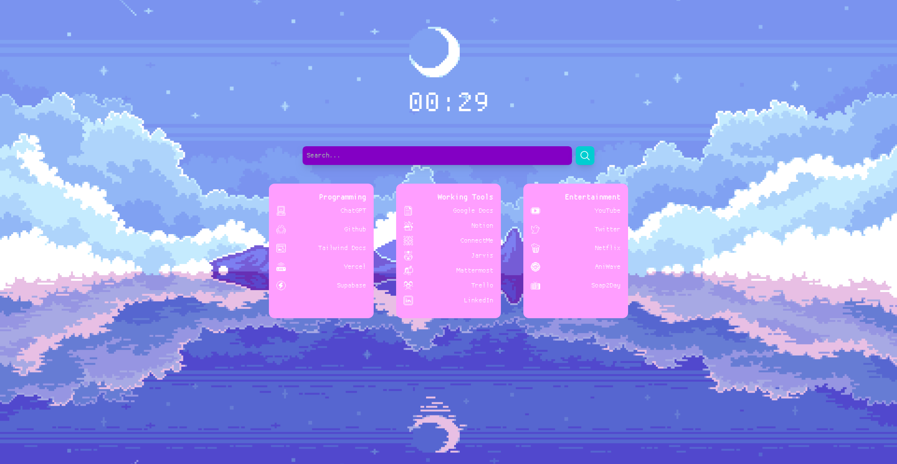

# Firefox Homepage
This project is a personalized homepage for firefox. I don't like the deafualt function of the homepage and it's not customizeable at 
all thats why I started this project. I took inspiration from pixelart what I personaly like and I wanted it to be relaxing and clean.

## Functionalities
* The homepage has the basic functionalities for the bookmarks you can see in the cards. These route to the sites I mostly use and need.
The cards are split into three categories: **Programming**, **Work** and **Entertainment** for easier navigation.

* Besides these I added two function for the searchbar the first was to have your cursor in the searchbar when you open the page because there
was a problem due to the [extension]('https://addons.mozilla.org/en-US/firefox/addon/new-tab-override/') I use that put that cursor in the URL bar automatically instead of the searchbar, and the second function I added
was to put your cursor in the search bar when you press CTRL + K. I know you are in the searchbar directly but when you are pressing around on the page
you might want to use the hotkey to get to the searchbar directly.

## Icons, fonts and more
The icons are from **[Streamline HQ]('https://www.streamlinehq.com/icons/pixel')**
<br />
The font I used is Proggy Clean from **[NerdFonts]('https://www.nerdfonts.com/font-downloads')**

## Upcoming features
* Spotify integration
* Todo list

## How to run (locally)
1. Clone the repo
```
git clone git@github.com:astronomx/firefox-homepage.git
```

2. Install the dependencies
```
npm install
```

3. Start the server (to run locally)
```
npm run dev
```

## How to use it yourself
**NOTE:** I use firefox and didn't test it on other browsers. So this example is for firefox.
1. Go to the [extension]('https://addons.mozilla.org/en-US/firefox/addon/new-tab-override/') page and install it.
2. Fork this repo and clone it to your local machine.
3. install the dependencies
```
npm install
```
4. Host the page on a server. I used [Vercel]('https://vercel.com/') for this.
5. Go to the extension settings and put the link to your hosted page in the URL field.
6. Press the **Keep Changes** button and you are done.
7. Enjoy your new homepage🥳 

## How to customize
This template is highly customizeable depending on your skills
all the customization is done in one place. In this section you will
see where to go in the code to edit the thing you want.

* **Background**
<br />
You can copy and paste the url of a picture in the
**src/app/app.tsx**

* **Fonts**
<br />
Install your favourite font an put the font in the **fonts** folder.
After you did that go to **src/app/layout.tsx** and change the name of the
font that you want it to be.

* **Cards**
<br />
The cards are highly customizeable you can change the color,
size, content and order of them in **src/app/components/Cards.tsx**

* **Searchbar**
<br />
If you want you can change the color, placeholder and icon of
the searchbar. This can be done in **src/app/components/Searchbar.tsx**